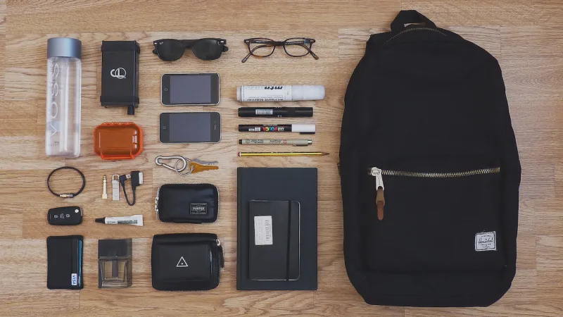
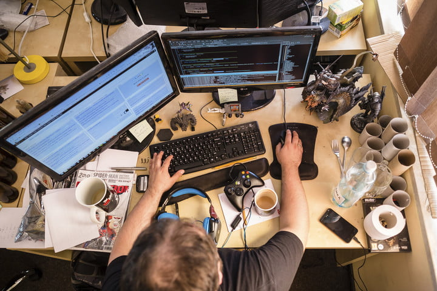
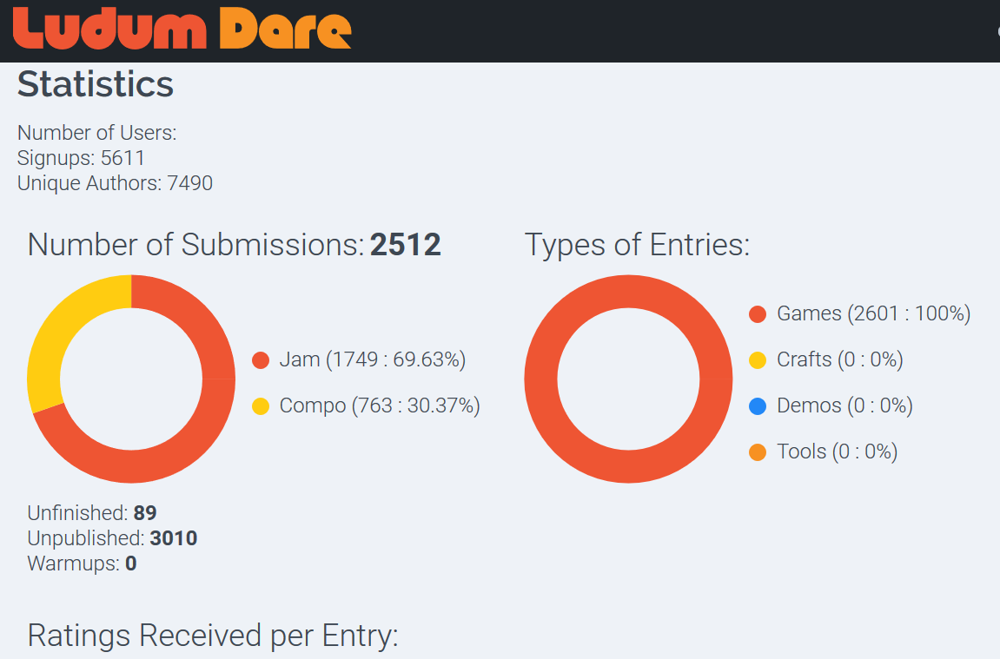

# Ludum Dare Survival Guide

> "It's dangerous to go alone! Read this."

Ludum Dare, the largest game jam on the planet, possibly in existence, should not be taken lightly. During this event, thousands of game developers from across the world congregate to attempt the unthinkable: build a game in less than 48 hours (or 72 if you're doing the compo).

The rules are simple, but execution is not. Ludum Dare has rebuffed countless developers attempting to answer its challenge. Many of these developers likely could have reached their goal if only they knew this: a successful Ludum Dare submission involves more than what meets the eye.

# Part 1: Preparation

> Treat the lead up to Ludum Dare how you would treat an important exam and set yourself up for success

## 1.1 Adopt the mindset

Before preparing for Ludum Dare, you need to make sure that you're preparing with the right goal in mind. Get into the Ludum Dare mindset: "I am going to __FINISH__ a game this weekend". You are not going to just make a game, you are going to __FINISH__ a game __this weekend__.

Keeping this goal in mind will help you when deciding on what content to create, how to budget your time, and which tools to use.

When you focus on finishing you will gravitate towards making decisions that push your project towards completion. That means fighting back against feature creep, sticking to a realistic scope, living with mistakes, and seizing every opportunity.

Anyone can make a game if they invest enough time into it, but only so few can make a game on such an extreme timeline and even fewer can make it _good_.

So if you want to succeed: get into the mindset of finishing, that is the most important part of conquering Ludum Dare.

> Tip: KISS (Keep It Simple Stupid), if you want to __FINISH__ then you have to keep it simple.

> Note: Here's an article by Derek Yu (creator of Spelunky) on [Finishing a Game](https://makegames.tumblr.com/post/1136623767/finishing-a-game). Many of these tips apply to Ludum Dare.

## 1.2 Schedule your time

Take a look at that 48-hour block and figure out how much time you'll need for each task. You'll have a lot of tasks to complete, including: designing, developing, polishing, debugging, submission, sleeping. Write it down on a piece of paper and keep it nearby.

Here's an example of what this might look like:

| schedule | task | hours
| - | :---: | - 
| 00 - 02 | upfront design | 2 
| 02 - 16 | develop | 14
| 16 - 22 | sleep | 6 
| 22 - 26 | develop | 4 
| 26 - 35 | polish | 9 
| 35 - 40 | debug | 5 
| 40 - 44 | sleep | 4 
| 44 - 48 | publish & submit | 4

This is one way to divide your time but you should tweak this to fit your specific needs; maybe you need to allocate time for art, or music, or UI, whatever the case, factor in what you see fit.

> Tip: Set milestones for yourself to prevent feature creep, for example: _"after the halfway mark I will not add any new features"_.  

## 1.3 Assemble your tools

> Select your fighter!

Decide what tools you'll be using for Ludum Dare. The specific tools don't matter as long as you're __comfortable__ with them and can develop quickly with them.

Test your tools, install required libraries, try to export a small project to make sure you have the right redistributables installed, you __definitely__ don't want to be looking for an exporter during Submission Hour.

Sign up for whatever distribution channel you will be using: itch.io, Newgrounds, Dropbox, etc.

> Tip: Test your tools by starting them one at a time, opening a recent project, and making sure everything is working correctly.

> Note: itch.io has an [article on Ludum Dare](https://itch.io/blog/178/get-ready-for-ludum-dare) that contains some information specifically on submitting to the platform

#### New tools?

Some developers use Ludum Dare as an opportunity to try new tools, for the majority of us this is a bad idea. Once again, the goal of Ludum Dare is to __finish__ a game, and that's much harder to do if your learning a new tool at the same time.

If you're set on using new/unfamiliar tools then get acquainted with them before Ludum Dare starts.

#### Teams

> I don't have many notes on teams because I haven't collaborated for Ludum Dare before

If you’re working on a team this is the time to assemble your team members. Make sure you are all on the same page with the same versions of software, collaborative tools, and designated roles.

## 1.4 Plan additional content

Many developers that attempt Ludum Dare will document the process somehow. This is a great way to bring attention to your project or brand. 

Here are some of the popular options:

- Postmortem: create a postmortem write-up/video that walks through your experience during the entire Ludum Dare weekend. This is also a great way to investigate which tactics worked and which did not.

- Time-lapse Video: create a video that shows a sped up version of you developing your project. Most time-lapses are a screen recording sped up to show the entire weekend in a few minutes.

	> Tip: remember to [Assemble Your Tools](#) - download a time-lapse creator and configure it beforehand.

- Stream: hosting a live-stream showing you working on your Ludum Dare submission. This can be a great way to stay motivated too because you'll have an audience to keep entertained. There are Ludum Dare tags on twitch.
	
	> Note: be careful with this one, streaming can get distracting, especially when you interact with your audience.

- Social media: Twitter's buzzing during Ludum Dare with countless devs sharing their progress ([I'll be one of them](http://twitter.com/shelsoloa)). In general social media is a great way to share your Ludum Dare with others in the scene.

Doing additional content is a way to get more out of your Ludum Dare, just be sure to strategize so it doesn't get in the way of your main goal: finishing.

## 1.5 Stock up

You may have a chance to take a break and run to the store during Ludum Dare, but you might not. This is definitely a decision nobody wants to be caught in: do I stop to get what I need or do I push through and do worse. It's best to just come prepared.

Here's a list of things to stock up on before the event:

- Groceries

  First for a reason: you're gonna have to eat and this will slow you dont. Eating out isn't an option if you're trying to maintain an efficient schedule, and skipping eating is not an option because Ludum Dare is not worth your long-term health.

  What foods should you eat? Look for foods that require little/no preparation but have some nutritional value (junk food can cause you to crash), or meal prep beforehand.

  > Tip: Energy drinks can provide that much needed burst of energy during late hours. Just don't overdo it and enjoy responsibly.

- Pen & Paper ~ if you do any form of hand-drawn/handwritten design then make sure you're stocked on paper and writing utensils.

  > Tip: Try doing your first design draft on paper __before__ you move on to programming.

- Camera/Scanner ~ for capturing design done on paper. Not really necessary during the compo if you plan on posting afterwards, but if you want to post during the event this is an additional measure to consider.

## 1.6 Get into form

In the days leading up to Ludum get more rest than usual so that you can better handle staying up a bit later than usual. Additionally, get some exercise in, exercise will help promote a clear mind, a bonus when making quick decisions and solving bugs under pressure.

In short: be healthy and prepare for stress.

# Part 2: Execution (During the Jam)

## 2.1 "Drink Water"

Take care of yourself. Ludum is a marathon and you'll need to be on your game if you really want to challenge this weekend.

- Sleep
 
  You probably don't want to sleep for 12 hours but the truth is that you'll need sleep at some point. During a 48-hour period most people sleep for an average of 12-16 hours.

  > Tip: if you've already finished your deep-work tasks then you can shorten your second sleep. You don't need to be "sharp" to tweak, build, and submit.

- Hygiene

  Mental health is impacted by the environment you keep, if your environment is dirty and crowded chances are your mind will be to. Keeping your environment (that includes both mind and body) physically clean will improve your performance, not to mention __YOUR PHYSICAL WELL BEING!__

  Many people decide to _“forgo”_ cleanliness during Ludum Dare because they view it as an unnecessary luxury, __DON'T__ be one of these people.

  > Tip: a few days before Ludum Dare give your entire workstation a deep clean.

## 2.2 Follow the plan

Remember that [Schedule](#) you made, well this is where you put it into effect.

If you told yourself that 4 hours was all the time you can budget for design then you should try your best to stick to that. Remember your goal is to finish, and you put a plan in place to help you do that.

Over-engineering is tempting but it is deadly this weekend. Don't do it. Stick to scope. Follow the plan.

> Note: You're never really "ahead" of time during Ludum Dare.

## 2.3 Don't start over

At a certain point you have to commit. If you think of a great new idea half way through it's usually better to file that idea away for after Ludum Dare.

If your project isn't working, and you have an __abundance__ of time, then try to pivot instead. Make tweaks to your game to get it to work, but don't scrap the idea all together.

You never know, maybe what you're missing is just a few lines of code in the right place.

## 2.4 Juice

"Juice" is a big part of game feel, it refers to the *little* things that make your game _feel_ good. Many developers skip adding juice because they don't consider it important, but you can very easily tell the difference between a submission __with juice__ and a submission __without__ it.

Menus, UIs, instructions, sound effects, transitions, particle effects, etc; are all forms of juice and they contribute to the experience of playing.

If you're looking for a way to set yourself apart from the pack then make this a focus. Even a small investment can reap large benefits when it comes to your submissions overall package.

> Tip: when you finish implementing the core mechanic start looking for ways to add juice while adding features, so you're not scrambling at the end to fit it in.

> Note: Here's [__THE__ video on adding juice](https://www.youtube.com/watch?v=Fy0aCDmgnxg) and a [bonus article on adding juice.](https://gameanalytics.com/blog/squeezing-more-juice-out-of-your-game-design.html)

## 2.5 Be mindful of the clock

Keep in mind how much time you have left. 10 hours might seem like plenty of time but remember all the tasks that you need to complete before Submission Hour hits. If you find that you're implementing or fixing features when the deadline starts to look then it's time to Cut. Cut. Cut.

> Tip: Set a time in your Schedule to start cutting out any feature's that aren't working.

## 2.6 Chill

Enjoy yourself. Don't get too wrapped up in what you wanted your game to be and how you wanted your development to go. Most Ludum Dare's will not go how you expect and that's fine! Just keep riding it out.. 

And please drink some water.

# Part 3: Completion

## 3.1 Congratulate yourself

You just made a game in 48 (or 72) hours! That's amazing. Take a moment to be proud of yourself and what you accomplished.

__If you didn't finish__ then congratulate yourself anyway on attempting the challenge. Things can get in the way of having a successful Ludum Dare weekend, you gave it your best shot. 

Whatever the outcome: reflect on the entire process. This was a learning opportunity and the next time you challenge Ludum Dare you'll be even more prepared.

## 3.2 Getting your submission noticed

Ludum Dare's sorting algorithm shows submissions based on the activity of their creator, so first of __if you want to get noticed you have to play, rate, and comment on other submissions__. Secondly, you should post your submission to forums and social media, not everyone is lurking around the Ludum Dare forums.

## 3.3 What Else

This is the time to share that additional [content you planned earlier](#plan-your-content). Even if you didn't finish you can still share a postmortem and talk about the obstacles that caused your demise.

# Wrapping Up!

Ludum Dare is a fun experience, and many of us become repeat challengers. You can always use Ludum Dare as a get away from the day-to-day grind, a chance to try out something new and be creative.

If you're prepared, you just might survive.

~ shel soloa [@shelsoloa](http://twitter.com/shelsoloa)

> This is version 1 of the Ludum Dare Survival Guide. If you want to help make this guide better, then give me a hand and [open a PR on Github](http://github.com/shelsoloa/LudumDareSurvivalGuide)!