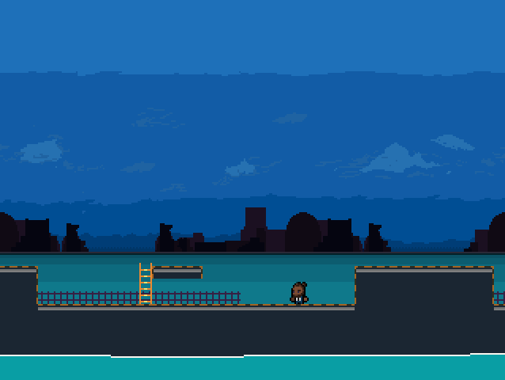
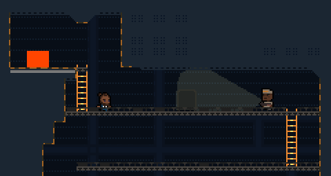
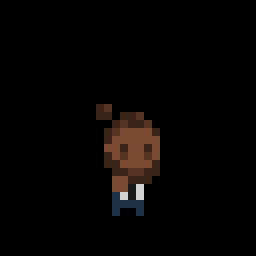

> Agent Obie is a hobby project and is developed on an irregular basis.
> ~ shel soloa ([@\_shellbot\_](http://twitter.com/_shellbot_))

#Agent Obie
Agent Obie is a 2D stealth platformer. In Agent Obie you must navigate through a variety of dubious levels using precise platforming skills, your arsenal of gadgets, and maybe even some luck to overcome the nefarious plot set forth by Dr. Diabolico.

## Story
Agent Obie is a spy working for the Onyx Collective, a global initiative to prevent evil from taking over.

Obie and his team have recently been contracted to investigate what could be a chemical weapon being developed in the Desert. He is sent on the mission alone and must infiltrate the secret lair of Dr. Diabolico and prevent them from causing mass destruction.

## Background on Agent Obie
Agent Obie has currently been in development for roughly two years, however that time isn't continuous, the amount of concurrent time spent developing agent obie is probably closer to 2 months.

## Tools Used
Agent Obie was originally developed using a custom built engine (that I eventually open-sourced under the name [Peachy](/projects/peachy "Peachy Project Page") ) but development time was far too slow so I eventually started using Godot!

I build levels in Tiled2D, create sprites in either PyxelEdit or GraphicsGale, and use sfxr for sound effects.

## Links
 - Download - There is one available binary file for Agent Obie [AgentObie_Alpha3]() (not representative of the current or finished product)
 - Source code - Agent Obie is currently available on [Github](http://github.com/shelsoloa/agentobie)
 - [Twitter](http://twitter.com/_shellbot_) - if you want more updates on all the stuff I'm working at [@\_shellbot\_](http://twitter.com/_shellbot_)

 